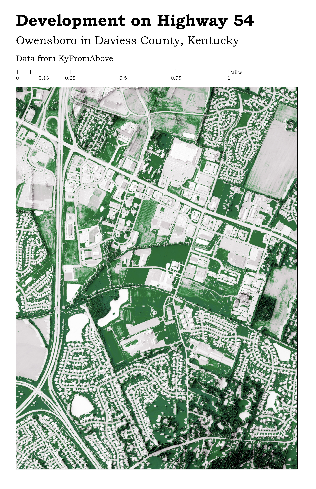

# highway54-owensboro-ky
# The Green around the Owensboro Speedway
## Owensboro, Kentucky

This map is a snapshot of the land alongside KY Highway 54, which cuts through my hometown of Owensboro and has been the epicenter for rapid development of the last fifteen years. I wanted to capture a high-resolution image of this area because it has been completely transformed in recent years and my efforts in this project represent a snapshot into the past for me, within which I can look back and picture what the scenery used to look like. I joke and call this area the Owensboro Speedway because traffic along Highway 54 and the Interstate 165 spur is always a challenge to contend with. 

     
*A top-down view of the busiest highway in Owensboro, rendered using Blender software.*

[Link to high-resolution pdf](Oboro54.pdf)     

Map produced by Lucas Ruckdeschel
For GEO 409 in the Department of Geography at the University of Kentucky
Data collected by KyFromAbove
Map produced in ArcGIS using imagery rendered in Blender